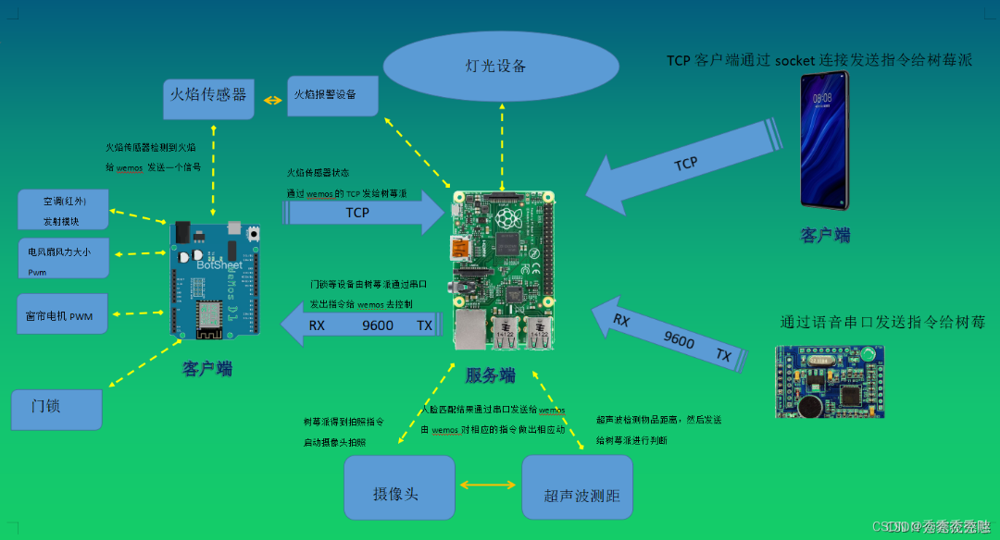
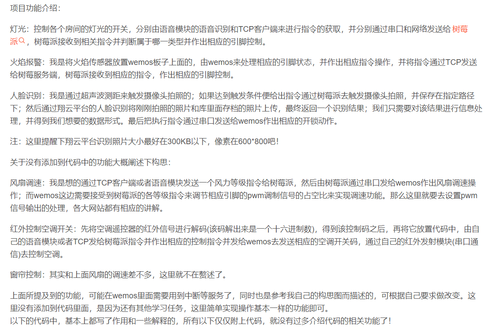

# //TOD0 暂时只列举代码图片，后期重构

# <1>



## <2>项目功能介绍



## <3>模块代码

### 设备头文件和线程指令头文件如下：

```
#include <wiringPi.h>
#include <string.h>
#include <stdlib.h>
#include <stdio.h>
#include <sys/time.h>
```

/*超声波测距的引脚初始化*/

```
#define Trig    4
#define Echo    5
```

```
float disMeasure(void);//关于超声波测距的函数，返回一个距离值，单位厘米

extern char camera_buf[1024];//用于读取人脸识别返回的信息,定义全局变量

unsigned int camera_Function_ReadStatus();//用于摄像功能的
```

```
struct Devices
{ 
	char deviceName[128];
	int status;
	int pinNum;
	int (*open)(int pinNum);
	int (*close)(int pinNum);
	int (*deviceInit)(int pinNum);//初始化端口

​	unsigned int (*readStatus)();//主要对设备的工作状态的读取
​	int (*changeStatus)(int status);

​	struct Devices *next;

};
```

```
struct Devices *add_bedroom_Light_ToDeviceLink(struct Devices *phead);//浴室灯功能链表链接头文件函数名
struct Devices *add_stair_Light_ToDeviceLink(struct Devices *phead);//二楼灯功能链表链接头文件函数名
struct Devices *add_warehouse_Light_ToDeviceLink(struct Devices *phead);//餐厅灯功能链表链接头文件函数名
struct Devices *add_living_Light_ToDeviceLink(struct Devices *phead);//客厅灯功能链表链接头文件函数名
struct Devices *add_Fire_Alarm_ToDeviceLink(struct Devices *phead);//火焰警报功能链表链接头文件函数名
```

```
#include <wiringPi.h>
#include <wiringSerial.h>
#include <string.h>
#include <stdlib.h>
#include <stdio.h>
#include <sys/types.h>          /* See NOTES */
#include <sys/socket.h>
//#include <linux/in.h>
#include <arpa/inet.h>
#include <netinet/in.h>
#include <unistd.h>
#include <pthread.h>
```

```
struct InputCommander
{
	char commandName[128];//功能函数的名称
	char deviceName[128];//主要用于系统自带的一些设备文件，比如 串口设备等等
	char command[32];//用于一些发出的指令
	int (*CommandInit)(struct InputCommander *Voicer, char *ipAdress, char *port);
	int (*GetCommand)(struct InputCommander *Voicer);
	char ipAddress[24];
	char port[12];
	char log[1024];//日志记录
	int fd;//一些语音功能的标识符
	int sfd;//一些socket功能的标识符
	struct InputCommander *next;
};
```

```
struct InputCommander *add_VoiceControl_ToDeviceLink(struct InputCommander *phead);//语言指令头文件函数
struct InputCommander *add_SocketControl_ToDeviceLink(struct InputCommander *phead);//socket指令头文件函数
```

### 主函数或程序入口代码：

```
#include <stdio.h>
#include <string.h>
#include "control_device.h"
#include "input_command.h"
```

```
//char camera_buf[1024];//用于读取人脸识别返回的信息,声明为外部变量
char *comd="DK GB TD TX";//用于命令的识别对比
```

```
pthread_mutex_t mutex;
pthread_cond_t cond;
```

```
struct InputCommander *phead_command = NULL;//指令链表头
struct Devices *phead_devices = NULL;//设备链表头
```

```
int c_fd;
struct InputCommander *socketHandler = NULL;//用来锁定 socket 返回来的链表节点的结构体，这里设计全局变量

struct InputCommander *voiceHandler = NULL;//用来锁定 语音 返回来的链表节点的结构体,这里设计全局变量
```

/*
函数名称：char *WRtok(char *buf)
函数作用：用于处理判断串口或者TCP穿过来的指令是属于哪一类
	输入：一个字符型指针，为第一指令 eg：DK GB 
	输出：返回一个第二指令	eg:LTD CKD ……
	说明：无
*/

```
char *WRtok(char *buf)
{
  char *arr=NULL;
  strtok(buf," ");
  arr=strtok(NULL,"!");
  if(arr==NULL)
  {
	arr = "AAA";	//防止因错误指令而返回空值
  }
  return arr;//涓虹浜屽弬鏁?
}
```

/*
函数名称：struct Devices *find_InputCommander_By_Name(char *buf,struct InputCommander *phead)
函数作用：用于查找功能线程的链表，也可通过自己需要添加或者删除
	输入：传入一个查找名称的字符型指针和一个设备而的链表头
	输出：返回一个已有的设备的链表节点，如果没有返回NULL
	说明：如果没有其他要求，可以直接吧这个函数作为一个必须执行的函数
*/

```
struct InputCommander *find_InputCommander_By_Name(char *buf,struct InputCommander *phead)
{ 
	struct InputCommander *tmp = phead;
	if(tmp == NULL)	//如果传过来的查找链表为空，
	{
		printf("This is an empty list of Pointers !\n");
		return NULL;
	}
	else
	{
		while(tmp != NULL)
		{
			if(strcmp(buf,tmp->commandName)==0)
			{ 
				printf("find InputCommander name is :%s \n",tmp->commandName);
				return tmp;
			}
			tmp = tmp->next;
		}
	}
	return NULL;
}
```

/*
函数名称：struct Devices *find_Devices_By_Name(char *buf,struct Devices *phead)
函数作用：用于查找设备的链表，也可通过自己需要添加或者删除设备
	输入：传入一个查找名称的字符型指针和一个设备而的链表头
	输出：返回一个已有的设备的链表节点，如果没有返回NULL
	说明：无
*/

```
struct Devices *find_Devices_By_Name(char *buf,struct Devices *phead)
{
	printf("\n The name of the device to be searched is : %s \n",buf);
	struct Devices *tmp = phead;
	if(tmp == NULL)
	{
		printf("This is an empty linked list !\n");
		return NULL;
	}
	else
	{
		while(tmp != NULL)
		{
			if(strcmp(buf,tmp->deviceName)==0)
			{
				return tmp;
			}
			tmp = tmp->next;
		}
	}
	return NULL;
}
```

/*
函数名称：Password_function(char *name)；指令查找函数
函数作用：用于查询传过来的指令进行设备的匹配
	输入：一个字符指针
	输出：一个整形数
	说明：无
*/

```
int Password_function(char *name)
{
		char *p=NULL;
		char *p_buf[32]={'\0'};
		strcpy(p_buf,name);	//备份指令的全部数据
		printf("\n Password get command name is : %s \n",name);
		p=WRtok(p_buf);	//p_buf是第一指令，p是第二指令
		printf(" comd p_buf : %s;p : %s !\n",p_buf,p);
		

​	//遍历链表，实现一些功能查找
​	struct Devices *phead_tmp = find_Devices_By_Name(p,phead_devices);
​	if(phead_tmp == NULL)
​	{
​		printf("NULL There's no 'AAA' in the linked list of devices !\n");
​		//phead_tmp = NULL;
​		//memset(name,0,sizeof(name));//对前面需要查找的名称进行清除大小
​		memset(p_buf,0,sizeof(p_buf));
​		//memset(p,0,sizeof(p));
​	}
​	if(0==strcmp(p_buf,"DK"))
​	{
​		if(phead_tmp == NULL)
​		{
​			printf("DK There's no '%s' in the linked list of devices !\n",p);
​			phead_tmp = NULL;
​		}
​		else
​		{
​			//真正各功能函数被调传的参数是这边找到对应的指针节点而进行传参的；例如 int pinNum 
​			phead_tmp->deviceInit(phead_tmp->pinNum);
​			phead_tmp->open(phead_tmp->pinNum);
​		}
​		//memset(name,0,sizeof(name));//对前面需要查找的名称进行清除大小
​		memset(p_buf,0,sizeof(p_buf));
​		//memset(p,0,sizeof(p));
​	}
​	else if(0==strcmp(p_buf,"GB"))
​	{
​		if(phead_tmp == NULL)
​		{
​			printf("GB There's no '%s' in the linked list of devices !\n",p);
​			phead_tmp = NULL;
​		}
​		else
​		{
​			//真正各功能函数被调传的参数是这边找到对应的指针节点而进行传参的；例如 int pinNum
​			phead_tmp->deviceInit(phead_tmp->pinNum);//在初始化函数里面，默认是关闭状态
​		}
​		//memset(name,0,sizeof(name));//对前面需要查找的名称进行清除大小
​		memset(p_buf,0,sizeof(p_buf));
​		//memset(p,0,sizeof(p));
​	}

}
```

/*
函数名称：socket_Read_Thread()；socket服务端读取客户端数据的线程
函数作用：用于连接客户端并读取客户端数据
	输入：无
	输出：无
	说明：读取到的数据传给Password_function()进行设备的操作
*/

```
void *socket_Read_Thread()//针对socket中服务端读取的数据函数
{
	printf("this is socket_Read_Thread\n");
	int s_nread;
	char *s_date=NULL;
	while(1)
	{
		memset(socketHandler->command,0,sizeof(socketHandler->command));
		s_nread=read(c_fd,socketHandler->command,sizeof(socketHandler->command));
		if(s_nread==-1)
		{
			perror("read ");
		}
else if(s_nread>0)
		{
			s_date=socketHandler->command;
			printf("\n socket get command c_fd is %d ,num is %d ,content is : %s \n",c_fd,s_nread,socketHandler->command);
			//这里的socketHandler->command设置的全局变量，待会可以在main里面直接调用该变量去控制设备
			printf("\n socket get command s_date is : %s \n",s_date);
			Password_function(s_date);
		}
		else
		{
			printf("client quit !\n");
			break;
		}
	}
	return 0;
}
```

/*
函数名称：socket_thread()；socket服务端线程函数
函数作用：用于创建socket服务端，可用作网络设备的连接
	输入：无
	输出：无
	说明：数据的读取在该函数内的pthread_create()线程里面
*/

```
void *socket_thread()
{
	printf("this is socket_thread\n");

struct sockaddr_in c_addr;
memset(&c_addr,0,sizeof(struct sockaddr_in));
int sizsock=sizeof(struct sockaddr_in);
pthread_t socket_Read;//去对接客户端的线程

//struct InputCommander *socketHandler= = NULL;//指令链表.socket链表头,此变量已被设置为全局变量了
//c_fd 设置为全局变量了
socketHandler = find_InputCommander_By_Name("socketControl",phead_command);//指令工厂.socket部分
if(socketHandler == NULL)
{
	printf("There is no data in the socket linked list !\n");
	pthread_exit(NULL);
}
else
{
	printf("this is open socketHandler\n");
	socketHandler->CommandInit(socketHandler,NULL,NULL);//在socket_control.c里面调用的socketInit初始化
}

while(1)
{	
	printf("Socket waiting connection ......\n");
	c_fd=accept(socketHandler->sfd,(struct sockaddr *)&c_addr,&sizsock);//服务端对客户端的连接端口
	pthread_create(&socket_Read,NULL,socket_Read_Thread,NULL);//当有客户端连接就创建一个线程去对接该客户端
}
//pthread_join(socket_Read,NULL);

}
```

/*
函数名称：voice_thread()；语音（串口）线程
函数作用：用于获取语音串口输出的数据，然后将该数据传给Password_function()函数进行设备的操作
	输入：无
	输出：无
	说明：波特率9600
*/

```
void *voice_thread()
{
	printf("this is voice_thread \n");
	int time=0;
	int v_nread;
	char *v_date=NULL;
	//struct InputCommander *voiceHandler = NULL;//用来锁定 语音 返回来的链表节点的结构体,这里已经设置成了全局变量
	pthread_mutex_lock(&mutex);
	voiceHandler = find_InputCommander_By_Name("voiceControl",phead_command);//指令工厂.语音部分;phead_command指指令链表头
	if(voiceHandler == NULL)
	{
		printf("There is no data in the voice linked list !\n");
		pthread_exit(NULL);
	}
	else
	{
		printf("this is open voiceHandler\n");
		if(voiceHandler->CommandInit(voiceHandler,NULL,NULL) <0)//语音串口的初始化调用，在voice_control.c里面调用的voice初始化
		{
			printf("Failed to initialize the voice serial port. Procedure !\n");
			pthread_exit(NULL);
		}
		else
		{
			printf("The voice serial port is initialized !\n");
		}
		pthread_cond_signal(&cond);
		pthread_mutex_unlock(&mutex);
		while(1)
		{
			v_nread = voiceHandler->GetCommand(voiceHandler);//语音指令的获取调用
			if(v_nread == 0)
			{	
				time++;
				if(time>100)
				{
					time=0;
					printf("The voice serial port has no data and the connection times out !\n");
				}
			}
			else
			{
				fflush(stdout);
				v_date=voiceHandler->command;
				printf("voicer read num is : %d ;fd is :%d ;datas : %s !\n",v_nread,voiceHandler->fd,voiceHandler->command);
				printf("voicer read v_date is : %d ;\n",v_date);
				Password_function(v_date);
			}
		}
	}
}
```

/*
函数名称：face_thread()
函数作用：用于进行人脸识别的结果进行匹配，且吧结果通过串口发送给wemos做相应的操作
	输入：无
	输出：无
	说明：其中调用了树莓派的摄像头拍照命令；与voice_thread()线程进行了条件加锁，只为获取串口的fd值用于wemos串口发数据
*/

```
void *face_thread()
{
	printf("this is face_thread\n");
	int dis;
	char *f_N="N"; 		//人脸识别通过串口发送给wemos板子的信号
	char *f_F="F";
	pinMode(Echo,INPUT);  //设置端口为输入
	pinMode(Trig,OUTPUT);  //设置端口为输出
	pthread_cond_wait(&cond,&mutex);	//设置线程等待锁是让串口线程先运行拿到串口的fd值，在运行face线程
	printf("face voicer fd is :%d !\n",voiceHandler->fd);
	while(1){
        dis = disMeasure();	//计算距离
        if(dis<=30)
        {
        	delay(1500);//第一次计算时间延时1.5秒
        	dis = disMeasure();	//第二次计算距离
        	if(dis<=30)
        	{
        		printf("Please face the camera !\n");
        		system("raspistill -t 500 -h 800 -w 600 -o /home/pi/Pictures/M2.jpg");//用于打开摄像头拍照
        		delay(500);
        		camera_Function_ReadStatus();//进行人脸识别
        		printf("distance = %d cm\n",dis);
        		//printf("camera_buf : %s\n",camera_buf);
        		if(strstr(camera_buf,"是")!=NULL)
				{
					printf("Picture contrast is the same ;comd is :%s !\n",f_N);
					write(voiceHandler->fd,f_N,strlen(f_N));			

​				}
​				else
​				{
​					printf("Picture contrast is the not same ;comd is len:%d ;siz:%d %s !\n",strlen(f_F),sizeof(f_F),f_F);
​					write(voiceHandler->fd,f_F,strlen(f_F));
​				}
​				memset(camera_buf,'\0',1024);
​    		}
   	 }
   	 delay(3000);
​	}

}
```

/*
函数名称：main()
函数作用：程序的入口
	输入：无
	输出：无
	说明：无
*/

```
int main()
{
	if(wiringPiSetup() == -1)//对树莓派初始化
	{
		return -1;
	}

pthread_t voice,socket,face;

pthread_mutex_init(&mutex,NULL);

//1.指令工厂初始化
/*
此变量已被设置为全局变量
struct InputCommander *phead_command = NULL;//指令链表头
struct Devices *phead_devices = NULL;//设备链表头
*/
//指令链表的链接
phead_command = add_VoiceControl_ToDeviceLink(phead_command);
phead_command = add_SocketControl_ToDeviceLink(phead_command);

//2.设备控制工厂初始化
//链接其他所有功能函数，并以phead_devices为头的链表呈现出来
phead_devices = add_bedroom_Light_ToDeviceLink(phead_devices);
phead_devices = add_stair_Light_ToDeviceLink(phead_devices);
phead_devices = add_living_Light_ToDeviceLink(phead_devices);
phead_devices = add_warehouse_Light_ToDeviceLink(phead_devices);
phead_devices = add_Fire_Alarm_ToDeviceLink(phead_devices);//火焰，需要单独弄个线程
//int pthread_create(pthread_t *restrict tidp, const pthread_attr_t *restrict attr, void *(*start_rtn)(void *), void *restrict arg);
// 返回：若成功返回0，否则返回错误编号

//3.线程池的建立
	printf("this is main thread\n");//验证程序是否有跑到这里

​	//3.1语音线程
​	pthread_create(&voice,NULL,voice_thread,NULL);

​	//3.2scoket线程
​	pthread_create(&socket,NULL,socket_thread,NULL);

​	//3.3摄像头线程
​	pthread_create(&face,NULL,face_thread,NULL);

//sleep(1);
//printf("this main voicer read datas : %s !\n",data); 
//intf("this main voicer read datas : %s !\n",voiceHandler->command); 
//printf("\n this socket get command content is %s \n",socketHandler->command);

pthread_join(voice,NULL);
pthread_join(socket,NULL);
pthread_join(face,NULL);

pthread_mutex_destroy(&mutex);
pthread_cond_destroy(&cond);
	
return 0;

}
```

### socket服务端分文件代码：

#include "input_command.h"
/*
函数名称：int socketInit(struct InputCommander *SocketMsg, char *ipAdress, char *port)
函数作用：用于socket创建的初始化
	输入：传入指令结构体内socket节点
	输出：返回一个s_fd
	说明：后面两个参数是多余的，因为第一参数传的就是一个完整的socket节点信息，可以直接调用里面的成员数据
*/
int socketInit(struct InputCommander *SocketMsg, char *ipAdress, char *port)
{
	printf("this socketInit\n");

	int s_fd;
	 
	/*创建socket服务端的套接字
	并在最后返回该套接字的标识符s_fd*/
	
	//1.int socket(int domain, int type, int protocol);
	s_fd=socket(AF_INET,SOCK_STREAM,0);
	if(s_fd==-1)
	{
		perror("socket failed : ");
		exit(-1);
	}
	
	//2.int bind(int sockfd, const struct sockaddr *addr,socklen_t addrlen);
	struct sockaddr_in s_addr;
	memset(&s_addr,0,sizeof(struct sockaddr_in));
	
	s_addr.sin_family=AF_INET;//以下为对sockaddr_in s_addr中的数据的一些设置配置
	s_addr.sin_port=htons(atoi(SocketMsg->port));
	inet_aton(SocketMsg->ipAddress,&s_addr.sin_addr);
	
	bind(s_fd,(struct sockaddr *)&s_addr,sizeof(struct sockaddr_in));
	 
	//3.int listen(int sockfd, int backlog);
	listen(s_fd,10);
	printf("listen ok \n");
	
	SocketMsg->sfd = s_fd;	//这个socketMsg是socketinit函数里面传的参数
	printf("this socketInit end\n");
	 
	return s_fd;
}


struct InputCommander socketControl = {
	.commandName = "socketControl",
	.command     = {0},
	.ipAddress   ="192.168.0.106",
	.port		 ="8988",
	.CommandInit = socketInit,
	.GetCommand  = socketGetCommand,
	.log         = {0},
	.next        = NULL
};

/*
函数名称：struct InputCommander *add_SocketControl_ToDeviceLink(struct InputCommander *phead)
函数作用：用于在main函数里面的指令链表链接的时候，将该节点添加进去
	输入：传入一个指令链表头
	输出：返回以本节点为头的链表
	说明：无
*/
struct InputCommander *add_SocketControl_ToDeviceLink(struct InputCommander *phead)
{
	if(phead == NULL)
	{
		return &socketControl;
	}
	else
	{
		socketControl.next = phead;
		phead = &socketControl;
		return phead;
	}
}

### 各个灯光设备的分文件代码：

（因为其他灯光代码基本相似，所有这里只发了一个参考版）

#include "control_device.h"


int living_Light_Open(int pinNum)//客厅灯打开
{
	printf("Open living_Light !\n");
	digitalWrite(pinNum,LOW);
}

int living_Light_Close(int pinNum)//客厅灯关闭
{
	printf("Close living_Light !\n");
	digitalWrite(pinNum,HIGH);
}

int living_Light_DeviceInit(int pinNum)//客厅灯初始化
{
	printf("Init living_Light !\n");
	pinMode(pinNum,OUTPUT);
	digitalWrite(pinNum,HIGH);
}

struct Devices living_light = {
	.deviceName   = "KTD",
	.pinNum       = 23,
	.open         = living_Light_Open,
	.close        = living_Light_Close,
	.deviceInit   = living_Light_DeviceInit
};

struct Devices *add_living_Light_ToDeviceLink(struct Devices *phead)
{
	if(phead == NULL)
	{
		return &living_light;
	}
	else
	{
		living_light.next = phead;
		phead = &living_light;
		return phead;
	}
}


### 关于超声波测距分文件代码：


//把文件重新设置为测距模块的函数

#include "control_device.h"

float disMeasure(void)
{
    struct timeval tv1;  //timeval是time.h中的预定义结构体 其中包含两个一个是秒，一个是微秒

    struct timeval tv2;
    long start, stop;
    float dis;
     
    digitalWrite(Trig, LOW);
    delayMicroseconds(2);//延时两毫秒
     
    digitalWrite(Trig, HIGH);
    delayMicroseconds(10);      //发出超声波脉冲
    digitalWrite(Trig, LOW);
     
    while(!(digitalRead(Echo) == 1));
    {  	 
    	gettimeofday(&tv1, NULL);           //获取当前时间 开始接收到返回信号的时候
    }
    while(!(digitalRead(Echo) == 0));
    {	
   		gettimeofday(&tv2, NULL);           //获取当前时间  最后接收到返回信号的时候
   	}
    start = tv1.tv_sec * 1000000 + tv1.tv_usec;   //微秒级的时间
    stop  = tv2.tv_sec * 1000000 + tv2.tv_usec;

    dis = (float)(stop - start) / 1000000 * 34000 / 2;  //计算时间差求出距离
     
    return dis;
}

###  关于人脸识别以及上传传翔云平台的分文件代码：

#include "control_device.h"

#include <curl/curl.h>
#include <sys/types.h>
#include <sys/stat.h>
#include <fcntl.h>
#include <unistd.h>


/*由于已将摄像拍照功能放置wemos上面读取，并通过TCP连接本项目的TCP server 服务端来进行指令的传输*/


#define true 1
#define false 0
typedef int bool;

char camera_buf[1024]={'\0'};//用于读取人脸识别返回的信息,定义全局变量

size_t readData( void *ptr, size_t size, size_t nmemb, void *stream)
{
	printf("this is Face readData !\n");
	strncpy(camera_buf,ptr,1024);
//	printf("========================================\n");
//	printf("%s\n",camera_buf);
}

char *getpicBase64FromFile(char *filePath)
{
	printf("this is Face getpicBase64FromFile !\n");
	char *bufpic;
	char cmd[128]={'\0'};
	sprintf(cmd,"base64 %s > ./tmpFile",filePath);
	system(cmd);
	int fd = open("./tmpFile",O_RDWR);
	int filelen= lseek(fd,0,SEEK_END);
	lseek(fd,0,SEEK_SET);
	bufpic=(char *)malloc(filelen+2);
	memset(bufpic,'\0',filelen+2);
	system ("cat /dev/null > /home/pi/stmart_house/Project-model/tmpFile");
	read(fd,bufpic,filelen+2);
	close(fd);
	system ("cat /dev/null > /home/pi/stmart_house/Project-model/tmpFile");
	
	return bufpic;
}


unsigned int camera_Function_ReadStatus()//对摄像功能对树莓派的控制引脚状态进行控制
{
	printf("this is Face recognition !\n");
	CURL *curl;
	CURLcode res;

	char *postString;
	 
	char *img1;
	char *img2;
	char *key="QUd43BWwVE5a9vM27tTCFY";
	char *secret="d46661d8d944484caf8929be4ce33185";
	int typeId=21;
	char *format="xml";
	 
	char *bufpic1 = getpicBase64FromFile("/home/pi/Pictures/M1.jpg");
	char *bufpic2 = getpicBase64FromFile("/home/pi/Pictures/M2.jpg");

 

	int len = strlen(key)+strlen(secret)+strlen(bufpic1)+strlen(bufpic2)+128;
	postString = (char *)malloc(len);
	memset(postString,'\0',len);
	sprintf(postString,"&img1=%s&img2=%s&key=%s&secret=%s&typeId=%d&format=%s",bufpic1,bufpic2,key,secret,21,format);
//	printf("postString = \n %s \n",postString);

	curl = curl_easy_init();
	if (curl)
	{
		curl_easy_setopt(curl, CURLOPT_COOKIEFILE, "/tmp/cookie.txt");// 指定cookie文件
		curl_easy_setopt(curl, CURLOPT_POSTFIELDS, postString);    // 指定post内容
		curl_easy_setopt(curl, CURLOPT_URL, "https://netocr.com/api/faceliu.do");   // 指定url
		curl_easy_setopt(curl, CURLOPT_WRITEFUNCTION, readData); 
		res = curl_easy_perform(curl);
		printf("OK:%d\n",res);


​		
		curl_easy_cleanup(curl);
	}
	return true;
}

### 以下是wemos相关代码：

#include<ESP8266WiFi.h>
#define PIN_Fire D8
const char* ssid = "MY";                    //“wifi热点名称”
const char* passward = "asdfghjklWIFI";            //”wifi热点密码”

const uint16_t port = 8988;
const char * host = "192.168.0.106"; // ip
WiFiClient client;//声明一个客户端的名字

/*网络连接的一些参数的初始化*/
void initWifiSta()
{
      WiFi.mode(WIFI_STA); //设置STA模式
      WiFi.begin(ssid, passward); //连接网络
      while(WiFi.status() != WL_CONNECTED) {
          delay(500);         
          Serial.print(".");               
      }
      Serial.print("WiFi connected, local IP address:");
      Serial.println(WiFi.localIP());      
}
/*连接TCP服务器函数*/
void InitTcp()
{
if (!client.connect(host, port)) //连接服务器并且判断是否连上
   {
        Serial.println("connection failed");
        Serial.println("wait 5 sec...");
        delay(5000);
        return ;
   }
    else
    {
      Serial.print("Already connecting to ");//发送给出串口
      Serial.println(host);
      //client.println("there are client TCP\n");//给服务器发送数据
    }
}
/*引脚配置初始化*/
void PIN_Init()
{
  pinMode(D2,OUTPUT);
  digitalWrite(D2,HIGH);//设置上电默认高电平
  pinMode(D3,OUTPUT);
  digitalWrite(D3,HIGH);//设置上电默认高电平
  }

void setup() {
   Serial.begin(9600);//设置串口的波特率
   pinMode(PIN_Fire,INPUT);
   initWifiSta();
   InitTcp();
   PIN_Init(); 
}
void loop() {
   //client.available();  //服务初始化
   char *fire="DK fire";
   char cmd;
   while(1)
   {
      if(Serial.available()>0)//串口有数据来了
      {
        cmd=Serial.read();
        if(cmd=='N')
        {
          Serial.println(cmd);
          digitalWrite(D2,LOW);
          delay(1000);
          digitalWrite(D2,HIGH);
          }
          else if(cmd=='F')
          {
            Serial.println(cmd);
            digitalWrite(D3,LOW);
            delay(300);
            digitalWrite(D3,HIGH);
            delay(300);
            digitalWrite(D3,LOW);
            delay(300);
            digitalWrite(D3,HIGH);
            delay(300);
            digitalWrite(D3,LOW);
            delay(300);
            digitalWrite(D3,HIGH);
            }
        }
      int fire = digitalRead(PIN_Fire);
      if(fire == 0)
     {
        Serial.println("DK fire");//给串口发送数据
        client.print("DK fire");//给服务器发送数据
        delay(1000);
      }
   }
}


简易的智能家居项目就这样，代码很简陋，设计很LOW，思路也简单；

那这里就说下在里面硬件需要注意的地方吧！

1.在wemos与树莓派串口通信的时候，注意一定要共地

2.语音模块最好采用树莓派上面的供电，如果单独供电也最好做好共地

3.关于字符处理等等，防止野指针，同时注意指针赋值和内存大小处理等，不要访问非法内存空间

4.多文件调用共用资源时，注意声明外部变量

5.多线程编程时，注意共享资源是否为不可变的

6.逻辑问题

7.网络编程一定要在同一局域网内通信

8.如何wemos需要运用到多任务的时候，最好设置中断，因为单片机不想带有操作系统还能多线程进程等等

9.一定要先有构思再编程