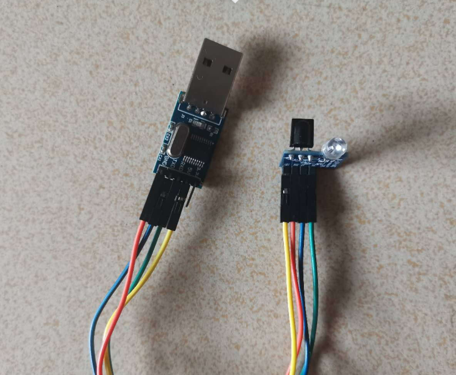
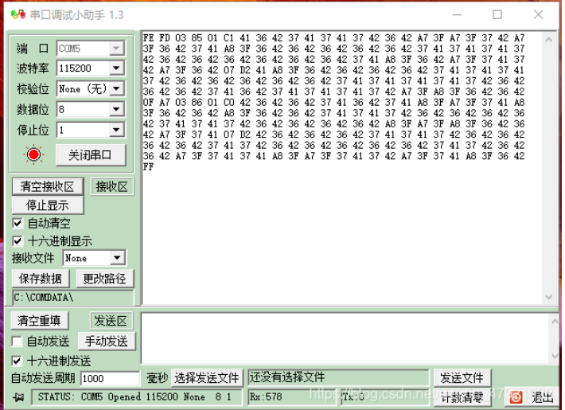

# //TOD0 红外编解码模块的使用

## 概述

- 使用树莓派、Arduino、语音模块、红外模块实现对家用空调进行控制
- 树莓派与Arduino进行TCP协议通信
- 树莓派与语音模块，Arduino与红外模块都进行串口通信

## <1>获取空调遥控器红外编码

将红外模块与TTL串口相连接，并插入电脑USB口（注意管脚接线正确）

将需要被解码的空调遥控器按键对着红外模块按下，即在串口上返回所需要的解码数据（注意波特率，这里默认为115200）

获取到红外编码后，将编码全部复制，以十六进制发送，红外模块对着空调，查看空调是否有反应

## <2>使用树莓派与Arduino进行TCP协议通信

-----

### 将Arduino做为服务端（代码参考）

#include <ESP8266WiFi.h>

char ssid[] = "1004";               /* wifi账号*/
char passwd[] = "13609618951";      /* 密码*/
int port = 8888;                    /* 端口号*/
WiFiServer server(port);            /* 设置服务器端口*/

const byte open_data[] = {      /* 空调红外开码*/
0xFE, 0xFD, 0x03, 0x85, 0x01, 0xC3, 0x40, 0x39, 0x3F, 0x3B, 0x3D, 0x39, 0x3F, 0xAA, 0x3D, 0x3B, 0x3D, 0x39, 0x3F, 
0xAA, 0x3C, 0x39, 0x3F, 0xAA, 0x3D, 0x39, 0x3F, 0x3C, 0x3C, 0xAA, 0x3F, 0x37, 0x3F, 0x39, 0x41, 0x37, 0x3F, 0x39, 
0x3F, 0x3C, 0x3C, 0x39, 0x3F, 0x39, 0x3F, 0x3C, 0x3D, 0x38, 0x40, 0x38, 0x40, 0x3B, 0x3D, 0x39, 0x3F, 0x39, 0x3F,
0x39, 0x3F, 0x39, 0x3F, 0x39, 0x3F, 0xAA, 0x3F, 0x37, 0x3F, 0xAA, 0x3D, 0x38, 0x3F, 0x3C, 0x3C, 0xAA, 0x3D, 0x39,
0x3F, 0x07, 0xD4, 0x3F, 0x3A, 0x3F, 0x3B, 0x3D, 0x39, 0x3F, 0x3B, 0x3D, 0x3B, 0x3D, 0x3C, 0x3F, 0x39, 0x3C, 0x39, 
0x3F, 0x39, 0x40, 0x38, 0x40, 0x38, 0x40, 0x38, 0x40, 0x3B, 0x3D, 0x39, 0x3F, 0x39, 0x3F, 0x39, 0x3F, 0x39, 0x3F, 
0x3A, 0x41, 0x37, 0x3F, 0x39, 0x3F, 0x39, 0x3F, 0x39, 0x3F, 0x39, 0x3F, 0x3C, 0x3C, 0x39, 0x40, 0x38, 0x40, 0x39, 
0x3F, 0x39, 0x3F, 0xAA, 0x3D, 0xA9, 0x3D, 0x39, 0x3F, 0xAA, 0x3D, 0x0F, 0xA9, 0x03, 0x83, 0x01, 0xC3, 0x3F, 0x3C, 
0x3C, 0x3C, 0x3D, 0x3B, 0x3C, 0xAA, 0x3D, 0x39, 0x3F, 0x3C, 0x3C, 0xAA, 0x3D, 0x39, 0x3F, 0xAA, 0x3C, 0x3C, 0x3C, 
0x39, 0x40, 0xA9, 0x3D, 0x3B, 0x3D, 0x3C, 0x3C, 0x39, 0x3F, 0x39, 0x3F, 0x39, 0x3F, 0x3A, 0x3E, 0x3C, 0x3C, 0x3C, 
0x3D, 0x38, 0x40, 0x39, 0x3F, 0x39, 0x3F, 0x39, 0x3E, 0x39, 0x40, 0x38, 0x40, 0x3B, 0x3D, 0x39, 0x3F, 0xAA, 0x3D,
0xA9, 0x3D, 0xAA, 0x3C, 0x39, 0x3F, 0x3A, 0x3F, 0xA9, 0x3D, 0x39, 0x3F, 0x07, 0xD4, 0x40, 0x39, 0x3F, 0x39, 0x3F, 
0x3B, 0x3D, 0x3B, 0x3F, 0x3A, 0x3C, 0x39, 0x3F, 0x3C, 0x3C, 0x39, 0x3F, 0x39, 0x3F, 0x39, 0x40, 0x38, 0x3F, 0x3C, 
0x3D, 0x3B, 0x3D, 0x3B, 0x3D, 0x3B, 0x3D, 0x39, 0x3F, 0x39, 0x3F, 0x39, 0x40, 0x38, 0x40, 0x39, 0x3F, 0x3B, 0x3D, 
0x39, 0x3F, 0x39, 0x3F, 0x3B, 0x3D, 0xAA, 0x3D, 0xAA, 0x3C, 0x3C, 0x3C, 0x39, 0x3F, 0xAA, 0x3D, 0xAA, 0x3C, 0x39, 0x40, 0xA9, 0x3D, 0xFF 
};

const byte close_data[] = {     /* 空调红外关码*/
0xFE, 0xFD, 0x03, 0x85, 0x01, 0xC1, 0x41, 0x37, 0x42, 0x36, 0x42, 0x36, 0x42, 0x36, 0x42, 0x36, 0x42, 0x36, 0x42, 
0xA7, 0x40, 0x36, 0x42, 0xA7, 0x3F, 0x37, 0x41, 0x37, 0x41, 0xA8, 0x3F, 0x36, 0x42, 0x37, 0x41, 0x37, 0x41, 0x37, 
0x41, 0x37, 0x42, 0x36, 0x42, 0x36, 0x42, 0x36, 0x42, 0x37, 0x41, 0x37, 0x41, 0x37, 0x42, 0x36, 0x42, 0x36, 0x42, 
0x36, 0x41, 0x37, 0x42, 0x36, 0x42, 0xA7, 0x3F, 0x37, 0x42, 0xA7, 0x3F, 0x37, 0x41, 0x37, 0x41, 0xA8, 0x3F, 0x36, 
0x42, 0x07, 0xD3, 0x41, 0x37, 0x41, 0x37, 0x41, 0x37, 0x42, 0x36, 0x42, 0x36, 0x42, 0x36, 0x42, 0x37, 0x41, 0x37, 
0x41, 0x37, 0x41, 0x37, 0x42, 0x36, 0x42, 0x36, 0x42, 0x37, 0x41, 0x37, 0x41, 0x37, 0x41, 0x37, 0x42, 0x36, 0x42, 
0x36, 0x42, 0x36, 0x42, 0x37, 0x41, 0x37, 0x41, 0x37, 0x41, 0x37, 0x42, 0x36, 0x42, 0x36, 0x42, 0x36, 0x42, 0x36, 
0x42, 0x36, 0x42, 0xA7, 0x40, 0xA7, 0x3F, 0x37, 0x41, 0x37, 0x42, 0x0F, 0xA8, 0x03, 0x85, 0x01, 0xC1, 0x42, 0x36, 
0x42, 0x36, 0x42, 0x36, 0x42, 0x37, 0x41, 0x37, 0x41, 0x36, 0x42, 0xA8, 0x3F, 0x36, 0x42, 0xA7, 0x3F, 0x37, 0x42, 
0x36, 0x42, 0xA7, 0x3F, 0x37, 0x41, 0x37, 0x41, 0x37, 0x42, 0x36, 0x42, 0x36, 0x42, 0x36, 0x42, 0x37, 0x41, 0x37, 
0x41, 0x37, 0x41, 0x37, 0x41, 0x37, 0x42, 0x36, 0x42, 0x36, 0x42, 0x36, 0x42, 0x36, 0x42, 0x37, 0x41, 0xA8, 0x3F, 
0xA7, 0x3F, 0xA8, 0x3F, 0x36, 0x42, 0x36, 0x42, 0xA7, 0x3F, 0x37, 0x42, 0x07, 0xD2, 0x41, 0x37, 0x41, 0x37, 0x42, 
0x36, 0x42, 0x36, 0x42, 0x36, 0x42, 0x36, 0x42, 0x36, 0x42, 0x37, 0x41, 0x37, 0x41, 0x37, 0x41, 0x37, 0x42, 0x36, 
0x42, 0x36, 0x42, 0x36, 0x42, 0x36, 0x42, 0x36, 0x42, 0x37, 0x41, 0x37, 0x41, 0x37, 0x41, 0x37, 0x42, 0x36, 0x42, 
0x36, 0x42, 0x36, 0x42, 0x36, 0x42, 0xA7, 0x40, 0xA7, 0x3F, 0x37, 0x41, 0x37, 0x41, 0xA8, 0x3F, 0xA7, 0x40, 0x36, 0x42, 0x36, 0x42, 0xFF 
};

void initWifi()     /* 建立Wifi网络模块*/
{
    WiFi.mode(WIFI_STA);            /* 设置为STA模式*/
    WiFi.begin(ssid, passwd);       /*输入wifi账号和密码*/

    while(WiFi.status() != WL_CONNECTED){
        Serial.print(".");
        delay(500);
    }
    
    Serial.println(WiFi.localIP());		/* 打印IP地址*/
    delay(500);

}

void setup()
{
    Serial.begin(115200);       /* 设置波特率*/
    initWifi();                 /* 初始化网络*/

}

void loop()
{
    char cmd;
    WiFiClient client = server.available();     /* 设置为服务端*/
    server.begin();     /* 服务端初始化*/
    

    while(client.connected()){          /* 检测是否连接*/
        while(client.available() > 0){  /* 如果串口中有数据*/
    
            cmd = client.read();        /* 将串口中的数据传给cmd*/
            //Serial.println(cmd);      /* 打印cmd*/
    
            if(cmd == '1'){
             // Serial.println("1111111111"); 
                Serial.write(open_data, (sizeof(open_data) / sizeof(open_data[0])));
            }
            if(cmd == '2'){
             // Serial.println("22222222");
                Serial.write(close_data, (sizeof(close_data) / sizeof(close_data[0])));
            }
        }
    }

}

### 树莓派作为客户端接入（代码参考）

#include<stdio.h>
#include<string.h>
#include<sys/types.h>
#include<sys/socket.h>
#include<netinet/in.h>
#include<arpa/inet.h>
#include<stdlib.h>
#include<unistd.h>
#include<wiringSerial.h>
#include<unistd.h>
#include<string.h>
#include<wiringPi.h>

int main(int argc, char *argv[])
{
    int fd;
    int c_fd;
    int ret;
    char cmd[128] = {'\0'};
    char a = '1';
    char b = '2';

    if(argc != 3){
        printf("input params error!\n");
        exit(0);
    }
    
    wiringPiSetup();        /* 硬件初始化，使用wiringPi引脚*/
    fd = serialOpen("/dev/ttyAMA0", 9600);      /* 打开串口*/
    if(fd == -1) {
        perror("open failed");
        exit(-1);
    }
    
    /* 创建网络套接字*/
    c_fd = socket(AF_INET, SOCK_STREAM, 0);
    if(c_fd == -1){
        perror("socket failed!\n");
        exit(-1);
    }
    
    /* 建立连接*/
    struct sockaddr_in addr;
    memset(&addr, 0, sizeof(addr));
    
    addr.sin_family = AF_INET;                  /* 设置IP协议*/
    addr.sin_port = htons(atoi(argv[2]));       /* 传递端口号，从网络（大端）到主机（小端）*/
    inet_aton(argv[1], &addr.sin_addr);         /* 传递IP地址*/
    
    ret = connect(c_fd, (struct sockaddr *)&addr, sizeof(struct sockaddr));
    if(ret == -1) {
        perror("connect wemos failed!\n");
        exit(-1);
    }else{
        printf("connected successfully\n");
    }
    
    while(1){
       
        read(fd, cmd, sizeof(cmd));     /* 读取语音模块发送的指令*/
        
        if(strstr(cmd,"open")){
            printf("accept open\n");
            write(c_fd, &a, sizeof(char));
        }
    
        if(strstr(cmd,"close")){
            printf("accept close\n");
            write(c_fd, &b, sizeof(char));
        }
        
        printf("cmd:%s",cmd);
    	memset(cmd, '\0', sizeof(cmd) / sizeof(char));
        serialFlush(fd);                /* 刷新缓冲区数据*/
        delay(200);
    }
    
    return 0;
}

